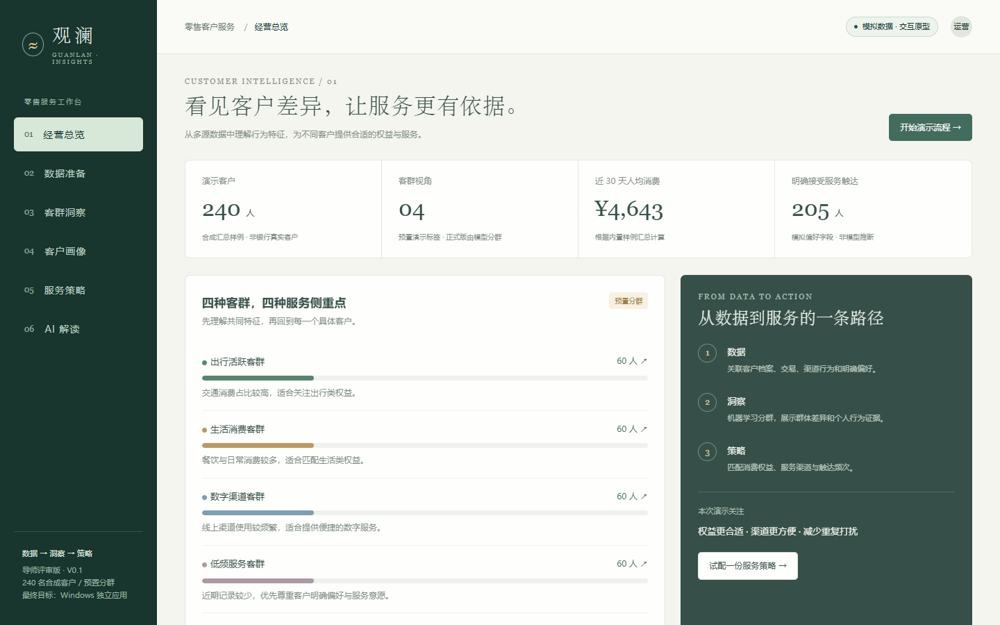

# 观澜｜零售客户智能画像与“千人千面”精准服务

这是供导师讨论的方案与交互原型，项目名暂定。原课题、两份公告文件保持不变。

## 项目方向

面向银行零售运营人员，按“多源模拟数据融合 → 机器学习客户分群 → 客群与个人画像 → 差异化权益／服务策略”构建可演示的经营分析流程。DeepSeek 的计划职责是根据结构化事实解释画像与建议。

| 材料 | 用途 |
| --- | --- |
| [导师评审方案 Word](观澜_导师评审方案.docx) | 供导师审阅和修改 |
| [方案文字版](方案文字版.md) | 在 GitHub 直接阅读 |
| [可点击原型](观澜_交互原型.html) | 下载后在浏览器打开；GitHub 文件预览不会执行 HTML |
| [协作约定](CONTRIBUTING.md) | 七人分工、功能分支与 PR 流程 |

## 打开方式

1. 阅读 `观澜_导师评审方案.docx`，了解目标、范围、技术路线、分工和验收安排。
2. 双击 `观澜_交互原型.html`，使用 Edge 浏览器查看可点击原型，无需安装依赖。
3. 建议演示顺序：经营总览 → 数据准备 → 客群洞察 → 客户画像 → 服务策略 → AI 解读。

## 当前完成与后续实现的区别

- 当前原型：240 名合成客户的汇总样例、页面切换、客群筛选、客户搜索与画像详情、策略条件调整、按规则计算候选人数、报告下载、基于样例的预置文字解读。
- 原型中的四个客群为预置演示标签；没有训练机器学习模型，没有实验性能分数，没有真实客户数据。
- AI 解读为根据样例事实拼装的演示文字，未调用 DeepSeek API，不收集 API Key。
- 原型支持下载汇总样例 CSV；正式版的 Excel/CSV 多表导入、明细融合、训练、模型评估、DeepSeek 联网调用和 Windows EXE 封装均列为后续开发。
- 最终软件目标是独立 Windows 窗口。本次 HTML 用于导师评审交互流程，不是最终 EXE。
- 原型显示的客群人数、消费统计与策略候选数来自内置样例；它们不代表银行经营结果。预设频控规则仅用于演示，需银行确认。

## 修改与核验

`方案内容.json` 是 Word 文档的可编辑内容源，`方案文字版.md` 便于快速查看；`tools/build_doc.cjs` 生成 Word，`tools/check_prototype.py` 检查主要交互。工具脚本按当前工作机环境编写，不是团队项目的正式运行依赖。

本仓库为公开的导师评审阶段资料库。当前没有银行数据或 API 密钥；文件尚未发送给导师或银行。算法训练、API 接入和 EXE 封装在方案确认后推进。

## 已执行的验证

- 240 条样例 CSV 的编号唯一性和消费占比一致性。
- 客群筛选、客户搜索、空结果、画像弹窗与解读页跳转。
- 18 种服务类型／频次／授权组合，与独立计算的候选名单核对。
- 导出草案与 AI 模板的状态标注。
- 六个页面在 1440、900、390 像素窗口宽度下无页面横向溢出。
- Word 文档 XML 结构校验。

以上验证针对交互原型，不是正式算法或真实 API 的验收。
